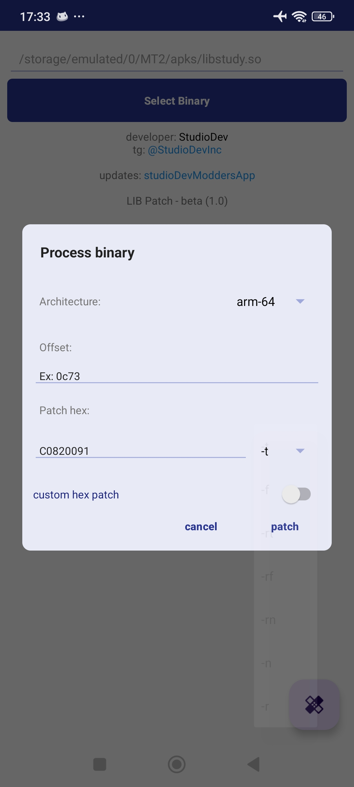
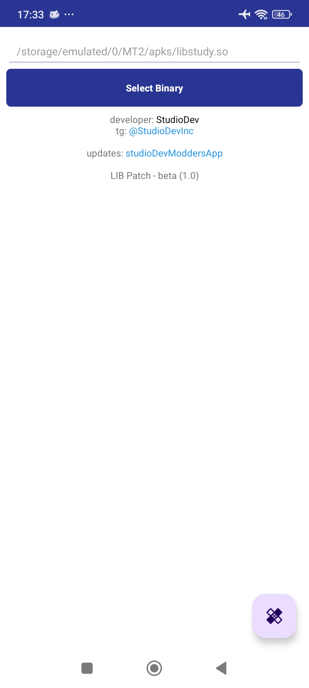

# **LIB Patch - Beta (1.0)**
Um aplicativo Android para aplicar **patches binários** em bibliotecas **.so**, permitindo a modificação rápida e eficiente de binários diretamente no dispositivo.

## **Recursos**
✅ **Patch de binários ELF (.so)** - Aplique modificações em bibliotecas compartilhadas.  
✅ **Suporte para arquitetura ARM64** - Compatível com a maioria dos dispositivos Android modernos.  
✅ **Edição rápida de binários Flutter** - Ferramenta simplificada para modificar arquivos Flutter.  
✅ **Modo de patch personalizado** - Permite inserir manualmente offsets e valores hexadecimais.  

## **Como Usar**
1. **Selecione o binário** (`.so`).
2. **Informe o offset e patch** (Hexadecimal).
3. **Aplique a modificação** com um clique.
4. **O app processa a alteração** e salva o novo binário.

## **Capturas de Tela**
 

## **Download**
Baixe o APK diretamente no repositório.

## **Contato & Atualizações**
📢 Desenvolvedor: **StudioDev**  
📬 Telegram: [@StudioDevInc](https://t.me/StudioDevInc)
